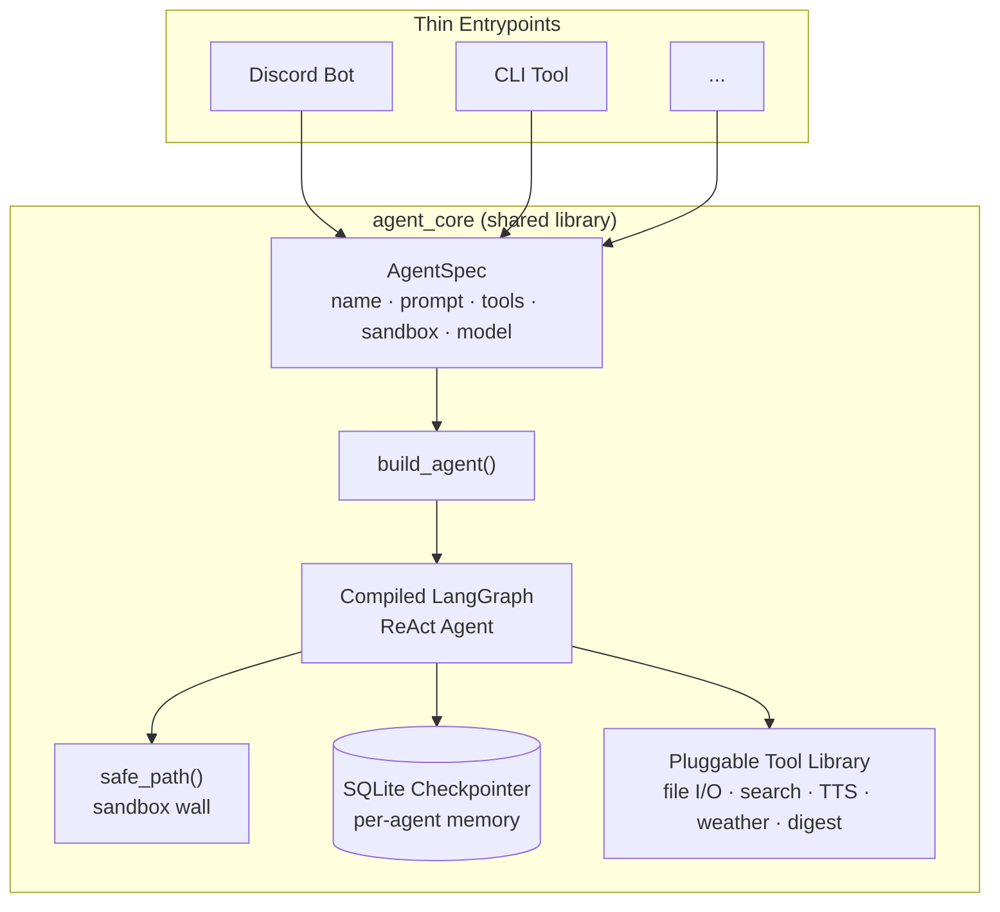

# cosmoai-adept

[](https://github.com/COSMOAGNOSTIC/cosmoai-adept/actions/workflows/tests.yml)
[](LICENSE)

A LangGraph-based framework for building multiple independent AI agents (Discord bots, CLI tools, etc.) that share one core library. Originally extracted and generalized from a production multi-agent system that has run continuously in a real deployment for months.

## Architecture



Each entrypoint is a thin script that supplies an `AgentSpec` — the framework does the rest. Every compiled agent shares the same sandbox enforcement, memory backend, and tool library; nothing is duplicated per-agent.

## Core Architectural Principles

**Spec-driven agents.** Every agent is defined by an `AgentSpec` - a name, system prompt, tool list, sandbox path, and model choice. `build_agent()` turns a spec into a compiled LangGraph ReAct graph. Adding a new agent means writing a spec and a thin entrypoint, not duplicating framework code.

**Sandboxed file access.** All file tools resolve paths through `safe_path()`, a mechanical wall that rejects any attempt to escape an agent's sandbox directory via `..` sequences, absolute paths, or symlinks - enforced at the tool layer, not the prompt layer.

**Per-agent persistent memory.** Conversation state is checkpointed via LangGraph's SQLite saver, one database per agent, so each agent resumes exactly where it left off.

**Tool-error recovery.** Tool failures are returned to the model as tool messages rather than raising, so the agent can see the error and retry or recover instead of crashing the whole run.

**Pluggable tool library.** File I/O, activity logging with a pending-items list, web search, text-to-speech, weather lookups, and a scheduled digest pattern that pulls sandbox state plus live search results into one report are all implemented once and shared by every agent.

## Structure

```
agent_core/
config.py environment-based configuration
security.py safe_path sandbox wall
agent.py AgentSpec consumer, ReAct graph factory
memory.py SQLite checkpointer factory
spec.py AgentSpec dataclass
text.py content normalizer, chunk splitter
tools/ one implementation per tool
tests/ full pytest suite, one file per module
```

## Installation

```
pip install -e ".[dev]"
```

## Testing

```
pytest -v
```

A GitHub Actions workflow runs the full suite on Python 3.11 and 3.12 for every push and pull request.

## License

MIT — see [LICENSE](LICENSE).
