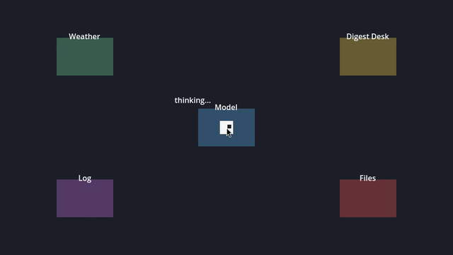
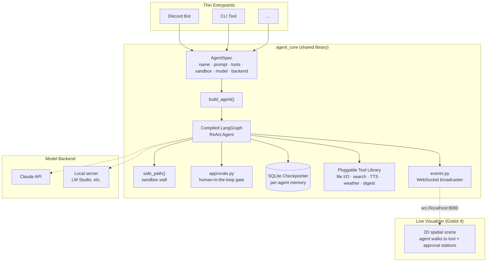

# cosmoai-adept

[](https://github.com/COSMOAGNOSTIC/cosmoai-adept/actions/workflows/tests.yml)
[](LICENSE)

**A real-time spatial visualizer and telemetry dashboard for multi-agent systems**, built on a LangGraph-based framework for multiple independent AI agents (Discord bots, CLI tools, etc.) that share one core library. Originally extracted and generalized from a production multi-agent system that has run continuously in a real deployment for months.



Every model call and tool call `agent_core` makes is broadcast as a WebSocket event ([`agent_core/events.py`](agent_core/events.py)) and rendered live in a 2D top-down scene ([`visualizer/`](visualizer/README.md)) built in Godot 4 — the agent walks to the station for whichever tool it's calling and shows a speech bubble with what it's doing. It's the same telemetry a production on-call dashboard would show, just legible at a glance instead of buried in logs.

## Architecture


```mermaid
flowchart TB
    subgraph Entrypoints["Thin Entrypoints"]
        A1["Discord Bot"]
        A2["CLI Tool"]
        A3["..."]
    end

    subgraph Core["agent_core (shared library)"]
        Spec["AgentSpec<br/>name · prompt · tools · sandbox · model · backend"]
        Build["build_agent()"]
        Graph["Compiled LangGraph<br/>ReAct Agent"]
        Sandbox["safe_path()<br/>sandbox wall"]
        Approval["approvals.py<br/>human-in-the-loop gate"]
        Memory[("SQLite Checkpointer<br/>per-agent memory")]
        Tools["Pluggable Tool Library<br/>file I/O · search · TTS · weather · digest"]
        Events["events.py<br/>WebSocket broadcaster"]
    end

    subgraph Models["Model Backend"]
        Anthropic["Claude API"]
        Local["Local server<br/>LM Studio, etc."]
    end

    subgraph Viz["Live Visualizer (Godot 4)"]
        Godot["2D spatial scene<br/>agent walks to tool + approval stations"]
    end

    A1 --> Spec
    A2 --> Spec
    A3 --> Spec
    Spec --> Build --> Graph
    Graph --> Sandbox
    Graph --> Approval
    Graph --> Memory
    Graph --> Tools
    Graph --> Events
    Graph -.-> Anthropic
    Graph -.-> Local
    Events -. "ws://localhost:8080" .-> Godot
```

Each entrypoint is a thin script that supplies an `AgentSpec` — the framework does the rest. Every compiled agent shares the same sandbox enforcement, memory backend, and tool library; nothing is duplicated per-agent.

## Quick Start

```python
from agent_core.spec import AgentSpec
from agent_core.agent import build_agent
from agent_core.tools.weather import get_weather

spec = AgentSpec(
    name="weather-bot",
    system_prompt="You are a terse weather assistant. Answer only with current conditions.",
    tools=[get_weather],
    sandbox="./sandboxes/weather-bot",
)

graph = build_agent(spec)

result = graph.invoke(
    {"messages": [("user", "What's it like in Bremerton, WA right now?")]},
    config={"configurable": {"thread_id": "weather-bot"}},
)

print(result["messages"][-1].content)
```

That's the whole contract: define an `AgentSpec`, hand it to `build_agent()`, and you get back a compiled, checkpointed LangGraph agent. Swap `system_prompt`, `tools`, and `sandbox` and you have a different agent — no framework code duplicated. `thread_id` scopes conversation memory, so a Discord channel ID or CLI session ID keeps each conversation's history separate within the same agent's SQLite database.

A complete, runnable version of this pattern — with more tools and a REPL loop — lives in [`examples/cli_demo.py`](examples/cli_demo.py):

```
python examples/cli_demo.py
```

## Watch It Live

`agent_core` broadcasts a WebSocket event on every model call and tool call — no configuration needed, it's a no-op until something connects. Open [`visualizer/`](visualizer/README.md) in Godot 4, run the main scene, then run the CLI demo (or [`visualizer/demo_broadcaster.py`](visualizer/demo_broadcaster.py) if you just want to see it move without an API key) and watch the agent walk between tool stations in real time.

## Human-in-the-Loop Approval

Any tool name in an `AgentSpec`'s `approval_required` set pauses before it runs — the agent walks to the Approval node in the visualizer and waits for a `approval_hook(tool_name, args) -> bool` to return before proceeding. No hook supplied means a blocking terminal y/N prompt ([`agent_core/approvals.py`](agent_core/approvals.py)) — fine for a CLI, wrong for anything unattended, so supply your own hook (a Discord reaction, a Slack button) for those. `examples/cli_demo.py` gates `write_file` this way.

## Local LLM Backend

Set `backend="local"` on an `AgentSpec` and `build_agent()` points the same ReAct loop at any OpenAI-compatible local server instead of the Claude API — LM Studio serving Qwen2.5-Coder or Gemma on `localhost:1234`, for example. Same tools, same graph, same visualizer telemetry; only the model client changes. `LOCAL_LLM_BASE_URL` in `.env` sets the default, or set `local_base_url` per-spec. Try it:

```
python examples/cli_demo.py --local
```

## Core Architectural Principles

**Spec-driven agents.** Every agent is defined by an `AgentSpec` - a name, system prompt, tool list, sandbox path, and model choice. `build_agent()` turns a spec into a compiled LangGraph ReAct graph. Adding a new agent means writing a spec and a thin entrypoint, not duplicating framework code.

**Sandboxed file access.** All file tools resolve paths through `safe_path()`, a mechanical wall that rejects any attempt to escape an agent's sandbox directory via `..` sequences, absolute paths, or symlinks - enforced at the tool layer, not the prompt layer. The sandbox root itself is bound once via each tool module's `make_*_tools(sandbox)` factory (`tools/files.py`, `tools/log.py`, etc.) when the entrypoint constructs its tools, not passed in by the model - `build_agent()` refuses to build an agent around any tool that still takes `sandbox` as an argument. See ARCHITECTURE.md §4 / ADR-009.

**Per-agent persistent memory.** Conversation state is checkpointed via LangGraph's SQLite saver, one database per agent, so each agent resumes exactly where it left off.

**Tool-error recovery.** Tool failures are returned to the model as tool messages rather than raising, so the agent can see the error and retry or recover instead of crashing the whole run.

**Pluggable tool library.** File I/O, activity logging with a pending-items list, web search, text-to-speech, weather lookups, and a scheduled digest pattern (`tools/digest.py`) that pulls sandbox state plus live search results into one report are all implemented once and shared by every agent.

**Observable by default.** `events.py` broadcasts every model call and tool call over a WebSocket, so any front end — the bundled Godot visualizer, a web dashboard, a log aggregator — can watch an agent think without touching agent internals.

**Human approval as a mechanical gate.** A tool name in `approval_required` pauses before it runs, full stop — not a prompt instruction the model could talk itself out of. Same pattern as `safe_path()`: enforced at the tool-execution layer, not the prompt layer.

**Swappable model backend.** `AgentSpec.backend` picks Anthropic or any OpenAI-compatible local server — same spec, same tools, same graph either way.

## Structure

```
agent_core/
config.py environment-based configuration
security.py safe_path sandbox wall
agent.py AgentSpec consumer, ReAct graph factory
events.py WebSocket event broadcaster
approvals.py human-in-the-loop approval hook
memory.py SQLite checkpointer factory
spec.py AgentSpec dataclass
text.py content normalizer, chunk splitter
tools/ one implementation per tool
examples/ runnable thin entrypoints
visualizer/ Godot 4 live spatial dashboard
tests/ full pytest suite, one file per module
```

## Project Docs

- [ARCHITECTURE.md](ARCHITECTURE.md) — component map, design principles, decision log
- [MIGRATION.md](MIGRATION.md) — phased build history with a definition of done per phase
- [PASSDOWN.md](PASSDOWN.md) — session-to-session handoff notes: what's done, what's next, open questions

## Installation

```
pip install -e ".[dev]"
```

## Testing

```
pytest -v
```

A GitHub Actions workflow runs the full suite on Python 3.11 and 3.12 for every push and pull request.

## License

MIT — see [LICENSE](LICENSE).
